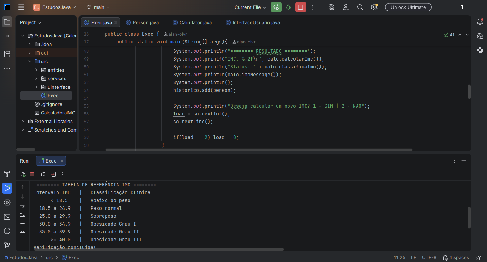
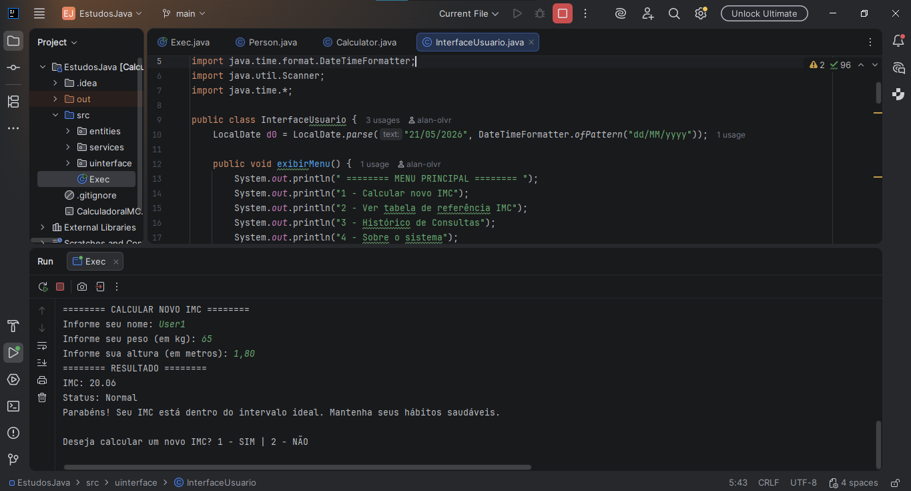
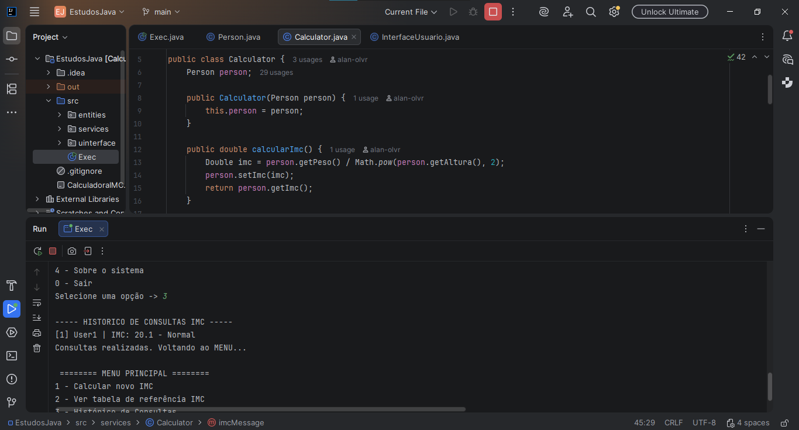

# 🧮 Calculadora IMC 

[Java](https://img.shields.io/badge/Java-17%2B-blue?style=flat-square&logo=java)
[Status](https://img.shields.io/badge/Status-Conclu%C3%ADdo-brightgreen?style=flat-square)
[Versão](https://img.shields.io/badge/Vers%C3%A3o-1.0-purple?style=flat-square)

> O IMC Calc foi desenvolvido como um projeto de estudo voltado à consolidação dos fundamentos da linguagem Java e das boas práticas de desenvolvimento backend.
> A aplicação oferece ao usuário um menu interativo para calcular seu IMC,
> visualizar a tabela de referência oficial, acompanhar um histórico de consultas da sessão
> e receber mensagens personalizadas com recomendações de saúde.

## 📸 Preview




## ✅ Funcionalidades

- [x] Cálculo do IMC a partir de peso (kg) e altura (m).
- [x] Classificação clínica em 6 categorias conforme padrão OMS.
- [X] Mensagens personalizadas com recomendações por faixa de IMC.
- [x] Histórico de consultas armazenado durante a sessão.
- [x] Tabela de referência IMC exibida no console.
- [x] Menu interativo com navegação contínua.

## ▶️ Como Rodar

### Pré-requisitos

- Java 17+ Instalado
- 
### Instalação

```bash
git clone https://github.com/seu-usuario/imc-calc.git
cd imc-calc
javac -d out src/entities/Person.java src/servicerules/Calculator.java src/uinterface/InterfaceUsuario.java src/Exec.java
java -cp out Exec
```

## 📁 Estrutura do Projeto

```
IMC-Calc/
├── src/
│   ├── entities/
│   │   └── Person.java              # Modelo de dados do usuário
│   ├── services/
│   │   └── Calculator.java          # Regras de negócio e cálculos
│   ├── uinterface/
│   │   └── InterfaceUsuario.java    # Interface e interações com o usuário
│   └── Exec.java                    # Ponto de entrada da aplicação
```

| Camada | Arquivo | Responsabilidade |
|---|---|---|
| Entidade | `Person.java` | Armazena nome, peso, altura, IMC e classificação |
| Serviço | `Calculator.java` | Calcula IMC, classifica e gera mensagens |
| UI | `InterfaceUsuario.java` | Exibe menu, lê entradas, formata saída |
| Main | `Exec.java` | Orquestra o fluxo principal da aplicação |

## ⚙️ Tecnologias e Conceitos Utilizados

**Linguagem:** Java 17+  
**Paradigma:** Programação Orientada a Objetos  

---

### Pilares da POO aplicados

| Pilar | Aplicação no Projeto |
|---|---|
| Encapsulamento | Atributos de `Person` são privados, acessados via getters/setters |
| Abstração | Cada classe expõe apenas o necessário para as demais camadas |
| Responsabilidade Única | Cada classe cumpre uma função específica e bem delimitada |
| Composição | `Calculator` recebe um `Person` via injeção no construtor |

---

### Java Standard Library

| Classe | Aplicação |
|---|---|
| `java.util.Scanner` | Leitura de entradas do usuário via console |
| `java.util.ArrayList / List` | Armazenamento dinâmico do histórico de consultas |
| `java.lang.Math.pow()` | Cálculo de potência para a fórmula do IMC |
| `java.time.LocalDate` | Registro e formatação da data de criação |
| `java.util.Locale` | Padronização de separadores decimais |

---

### Estruturas de Controle

- `do-while` — loop principal do menu, garante ao menos uma execução
- `while` — revalidação de entradas e ciclo de novos cálculos
- `switch-case` — despacho das opções do menu
- `if-else` — classificação do IMC nas 6 faixas clínicas
- `enhanced for` — iteração sobre o histórico de consultas

---

### Arquitetura

Separação em camadas seguindo o princípio de **Separação de Responsabilidades**:

| Camada | Pacote |
|---|---|
| Entidade | `entities` |
| Regras de Negócio | `services` |
| Interface do Usuário | `uinterface` |
  
## 🚀 Roadmap Melhorias V2

- [ ] Tratamento de exceções
- [ ] Persistência em arquivos `.txt`
- [ ] Enum para classificação IMC
- [ ] Testes unitários com JUnit
- [ ] Interface gráfica

## 💡 Aprendizados

- Separar responsabilidades entre camadas evitou retrabalho ao escalar o projeto.
- `Locale.US` resolveu um bug silencioso com separadores decimais em sistemas pt-BR.
- A ausência de tratamento de exceções foi o principal ponto fraco identificado.

## 👤 Autor

Feito por **Alan Oliveira** — [LinkedIn](https://www.linkedin.com/in/alan-oliveira-668515365/) · [GitHub](https://github.com/alan-olvr)


