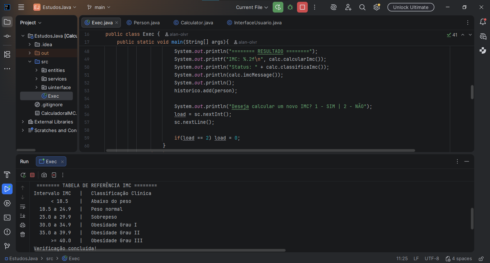
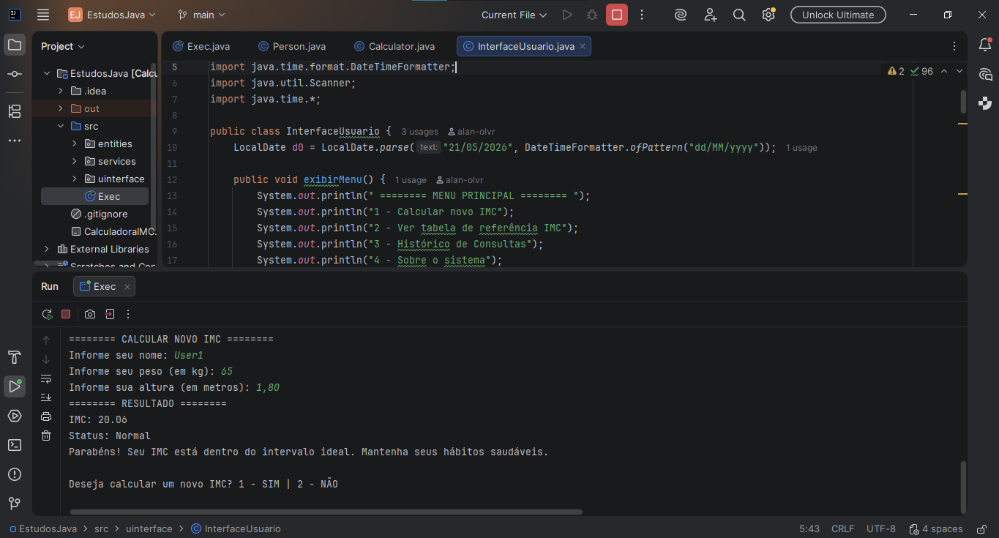
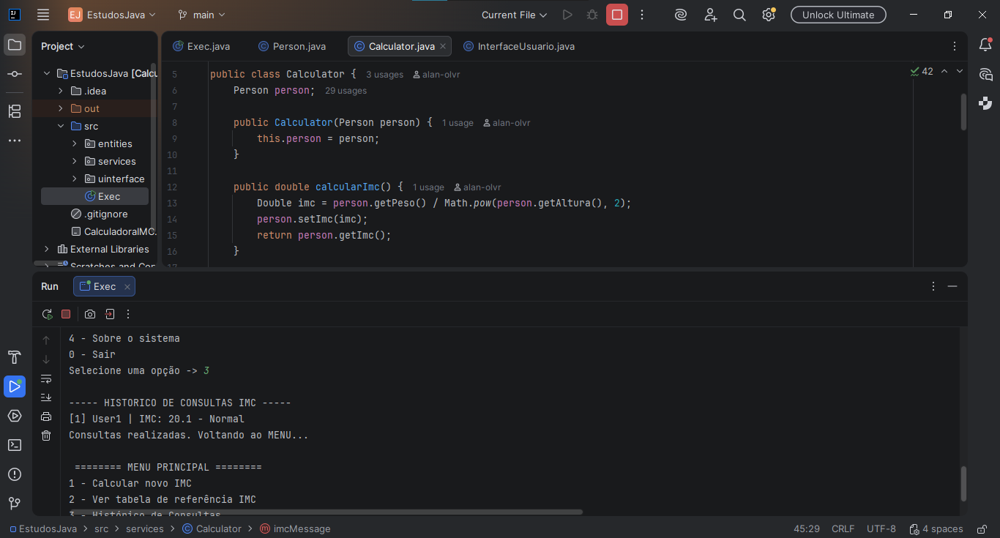

# 🧮 Calculadora IMC 

[Java](https://img.shields.io/badge/Java-17%2B-blue?style=flat-square&logo=java)
[Spring Boot](https://img.shields.io/badge/Spring%20Boot-4.1.0-brightgreen?style=flat-square&logo=springboot)
[Thymeleaf](https://img.shields.io/badge/Thymeleaf-Template%20Engine-005F0F?style=flat-square&logo=thymeleaf)
[Status](https://img.shields.io/badge/Status-Conclu%C3%ADdo-brightgreen?style=flat-square)
[Versão](https://img.shields.io/badge/Vers%C3%A3o-2.0-purple?style=flat-square)

> O IMC Calc foi desenvolvido como um projeto de estudo voltado à consolidação dos fundamentos da linguagem Java e das boas práticas de desenvolvimento backend.
> Na versão 2.0, o projeto evoluiu para uma aplicação web com **Spring Boot**, **Thymeleaf**, **HTML** e **CSS**, mantendo a lógica de negócio original e adicionando uma interface navegável no navegador para calcular o IMC, visualizar a tabela de referência oficial, acompanhar o histórico de consultas da sessão e receber mensagens personalizadas com recomendações de saúde.

## 📸 Preview




## ✅ Funcionalidades

- [x] Cálculo do IMC a partir de peso (kg) e altura (m) via formulário web.
- [x] Classificação clínica em 6 categorias conforme padrão OMS.
- [X] Mensagens personalizadas com recomendações por faixa de IMC.
- [X] Indicador visual da posição do IMC calculado.
- [x] Histórico de consultas armazenado durante a sessão, com opção de limpar.
- [x] Tabela de referência IMC em página própria.
- [x] Interface web navegável, estilizada com CSS e template compartilhado de navegação.

## ▶️ Como Rodar

### Pré-requisitos

- Java 17+ Instalado.
- Maven 3.8+ (ou wrapper `mvnw` incluso no projeto)

### Instalação

```bash
git clone https://github.com/alan-olvr/Calculadora-IMC.git
cd Calculadora-IMC/imc-calculator-web
mvn spring-boot:run
```

Depois, acesse **http://localhost:8080** no navegador.

## 📁 Estrutura do Projeto

```
imc-calculator-web/
├── src/
│ ├── main/
│ │ ├── java/imc_calculator/
│ │ │ ├── entities/
│ │ │ │ ├── Person.java -> Modelo de dados do usuário
│ │ │ │ └── ImcRange.java -> Faixa de classificação do IMC
│ │ │ ├── services/
│ │ │ │ ├── Calculator.java -> Regras de negócio e cálculo do IMC
│ │ │ │ ├── HistoricoService.java -> Armazena e gerencia o histórico de consultas
│ │ │ │ └── TabelaReferencia.java -> Fornece as faixas de referência do IMC
│ │ │ ├── ImcController.java -> Controller MVC, expõe as rotas web
│ │ │ └── ImcCalculatorApplication.java -> Ponto de entrada da aplicação Spring Boot
│ │ └── resources/
│ │ ├── static/css/
│ │ │ └── style.css -> Estilização da interface
│ │ └── templates/
│ │ ├── fragments/Nav.html -> Menu de navegação compartilhado
│ │ ├── index.html -> Formulário de cálculo do IMC
│ │ ├── resultado.html -> Exibição do resultado e recomendações
│ │ ├── tabela.html -> Tabela de referência do IMC
│ │ ├── historico.html -> Histórico de consultas da sessão
│ │ └── sobre.html -> Página sobre o projeto
│ └── test/
└── pom.xml
```

| Camada | Arquivo | Responsabilidade |
|---|---|---|
| Entidade | `Person.java` | Armazena nome, peso, altura, IMC e classificação |
| Entidade | `ImcRange.java` | Representa uma faixa de classificação do IMC |
| Serviço | `Calculator.java` | Calcula IMC, classifica e gera mensagens |
| Serviço | `HistoricoService.java` | Adiciona, lista e limpa o histórico de consultas |
| Serviço | `TabelaReferencia.java` | Fornece as faixas oficiais de referência do IMC |
| Controller | `ImcController.java` | Recebe requisições HTTP, orquestra os serviços e retorna as views |
| View | `templates/*.html` | Renderização das páginas via Thymeleaf |
| Estilo | `style.css` | Estilização da interface |

## 🌐 Rotas da Aplicação

| Método | Rota | Descrição |
|---|---|---|
| `GET` | `/` | Exibe o formulário de cálculo do IMC |
| `POST` | `/calcular` | Processa peso/altura e retorna o resultado |
| `GET` | `/tabela` | Exibe a tabela de referência do IMC |
| `GET` | `/historico` | Exibe o histórico de consultas da sessão |
| `POST` | `/historico/limpar` | Limpa o histórico de consultas |
| `GET` | `/sobre` | Exibe a página sobre o projeto |

## ⚙️ Tecnologias e Conceitos Utilizados

**Linguagem:** Java 17+
**Framework:** Spring Boot 4.1.0
**Template Engine:** Thymeleaf
**Estilização:** HTML + CSS
**Paradigma:** Programação Orientada a Objetos + arquitetura MVC

---

### Spring Boot

| Recurso | Aplicação no Projeto |
|---|---|
| `@Controller` | Define `ImcController` como controlador MVC |
| `@GetMapping` / `@PostMapping` | Mapeiam as rotas da aplicação |
| `@RequestParam` | Captura os dados enviados pelo formulário HTML |
| `Model` | Passa dados do controller para os templates Thymeleaf |
| Injeção de dependência via construtor | `HistoricoService` e `TabelaReferencia` injetados em `ImcController` |
| `redirect:` | Redireciona após limpar o histórico |

---

### Pilares da POO aplicados

| Pilar | Aplicação no Projeto |
|---|---|
| Encapsulamento | Atributos de `Person` são privados, acessados via getters/setters |
| Abstração | Cada classe expõe apenas o necessário para as demais camadas |
| Responsabilidade Única | Cada classe cumpre uma função específica e bem delimitada |
| Composição | `Calculator` recebe um `Person` via injeção no construtor |

---

### Arquitetura

Separação em camadas seguindo o padrão **MVC**, com o princípio de **Separação de Responsabilidades**:

| Camada | Pacote / Diretório |
|---|---|
| Entidade | `entities` |
| Regras de Negócio | `services` |
| Controller | `imc_calculator` (raiz do pacote) |
| View | `resources/templates` |
| Estilo | `resources/static/css` |

## 📜 Versão Original (Console)

A primeira versão do projeto foi desenvolvida em **Java puro**, sem framework, com interação via terminal usando `Scanner`, `do-while` para o menu principal e `switch-case` para navegação. A lógica de cálculo e classificação do IMC (`Calculator`, `Person`) foi reaproveitada como base para a versão web atual.

O código dessa versão permanece na raiz deste repositório, na pasta `src/`.

## 🚀 Roadmap Melhorias V3

- [ ] Tratamento de exceções
- [ ] Persistência em banco de dados (histórico entre sessões)
- [ ] Enum para classificação IMC
- [ ] Testes unitários com JUnit
- [ ] Deploy em ambiente de produção

## 💡 Aprendizados

- Migrar uma aplicação console para web com Spring Boot evidenciou a importância de separar bem controller, serviço e entidade desde o início.
- Thymeleaf simplificou a comunicação entre backend e views sem exigir um frontend separado.
- Separar responsabilidades entre camadas evitou retrabalho ao escalar o projeto.
- Reaproveitar a lógica de negócio original (`Calculator`) validou o valor de um bom desenho de camadas feito na versão em Java puro.
- A ausência de tratamento de exceções foi o principal ponto fraco identificado.

## 👤 Autor

Feito por **Alan Oliveira** — [LinkedIn](https://www.linkedin.com/in/alan-oliveira-668515365/) · [GitHub](https://github.com/alan-olvr)


